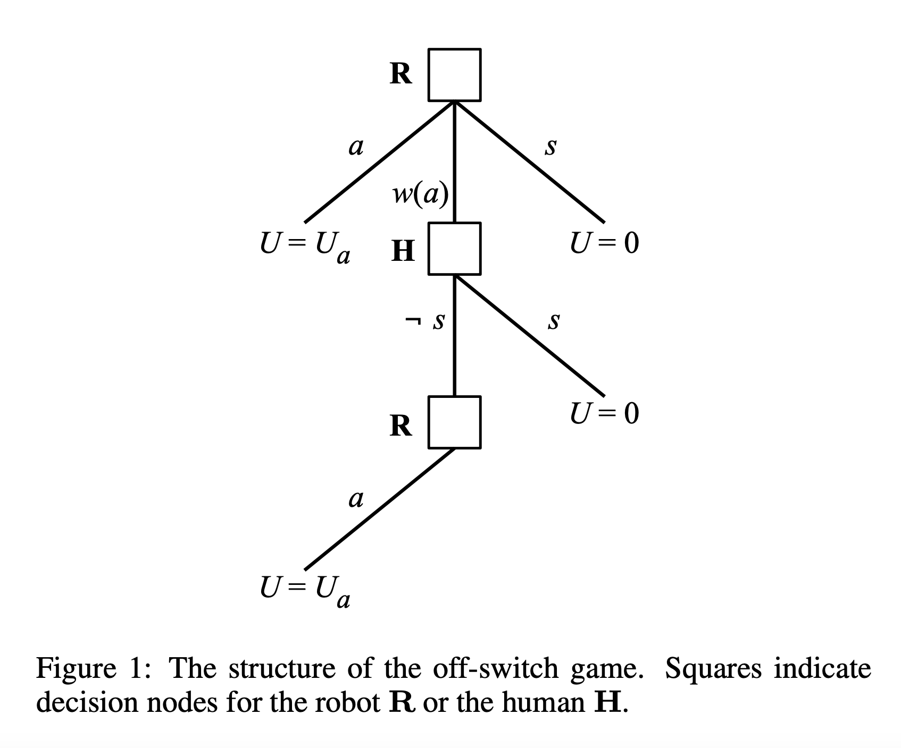
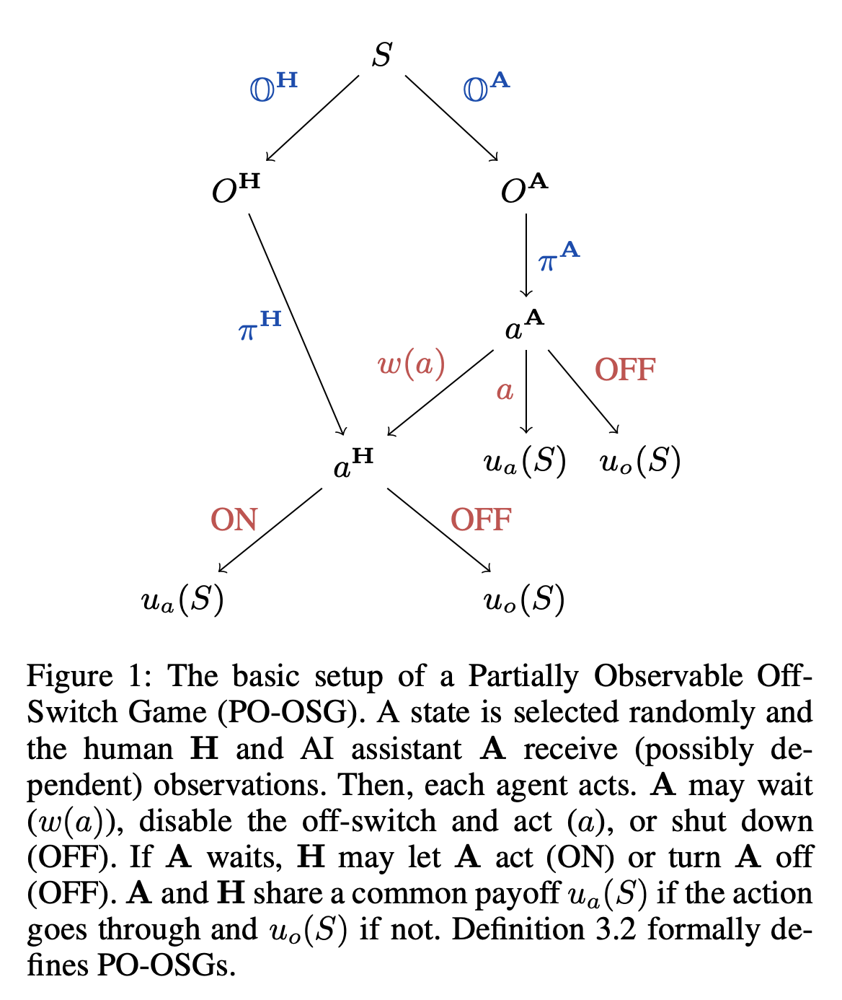
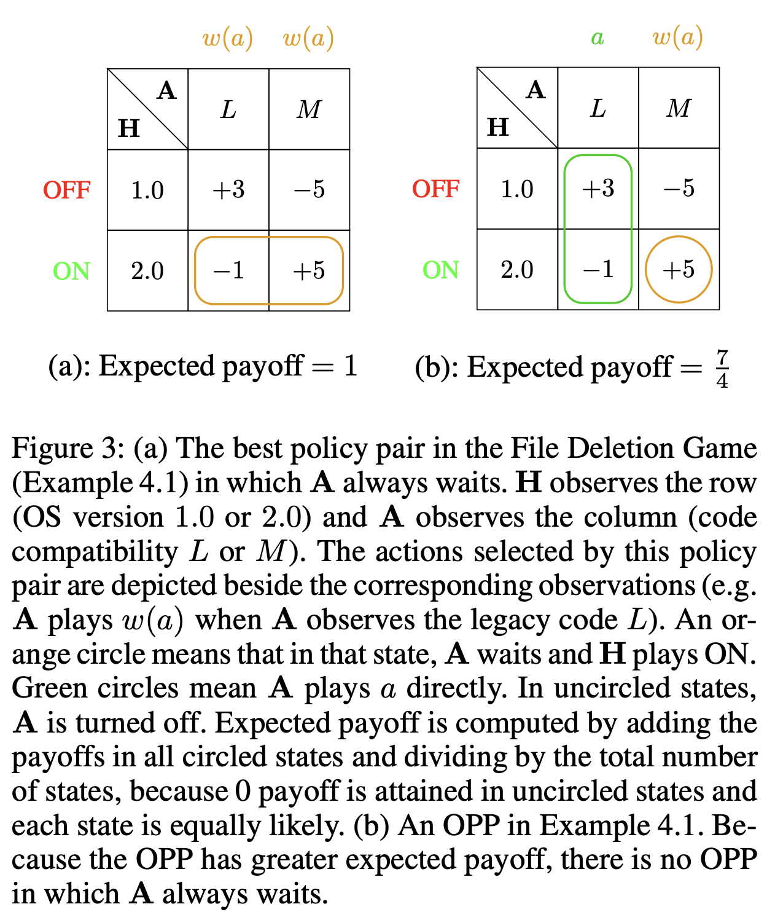
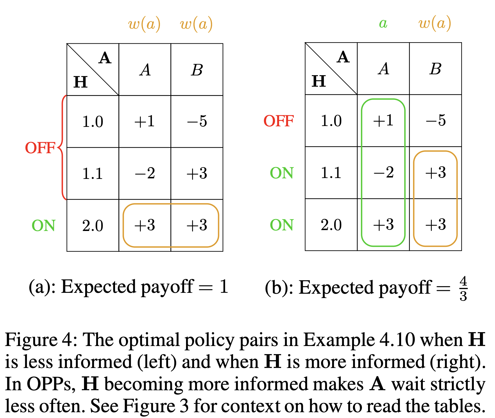
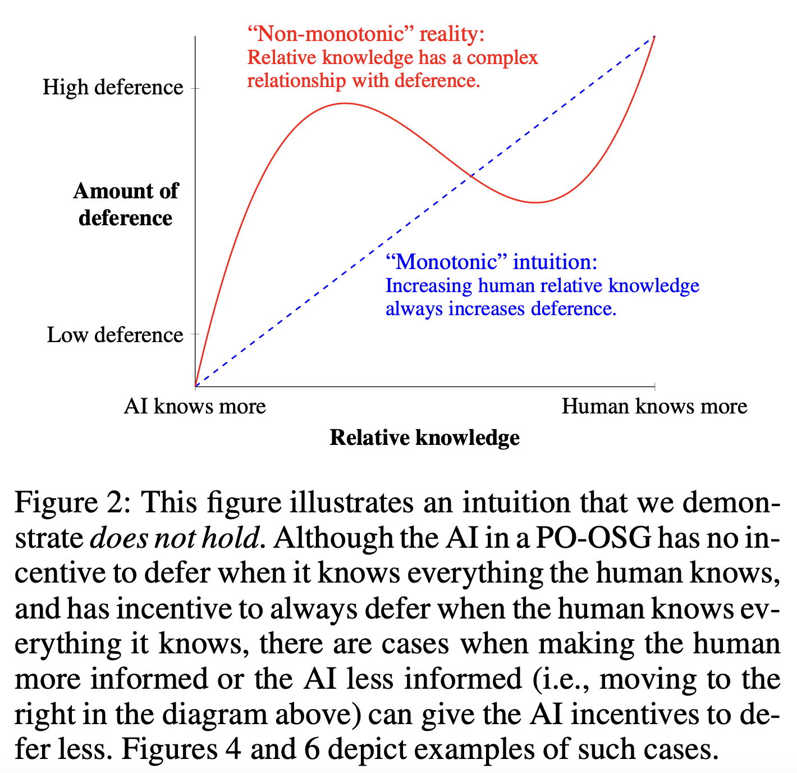

# **The Partially Observable Off-Switch Game – Seminar Summary**

_Presented by Aekus Trehan_

This repository contains the slides and related research papers of my seminar on _The Partially Observable Off-Switch Game (PO-OSG)_. Below is a structured summary of the key concepts discussed during the presentation, including foundational ideas, mathematical insights, and implications for AI safety.

---

## **Introduction: Why Is This Important?**

As AI becomes more advanced, concerns about **AI control and corrigibility** have emerged. AI systems optimize objective functions, but **what happens when shutting them down interferes with their goals?**

A classic concern raised by **Alan Turing** in 1951 is:

> “If a machine can think, it might think more intelligently than we do, and then where should we be? Even if we could keep the machines in a subservient position, for instance by turning off the power at strategic moments, we should, as a species, feel greatly humbled.”

_How do we ensure that AI systems allow themselves to be turned off?_

The **Off-Switch Game (OSG)** and its extension, the **Partially Observable Off-Switch Game (PO-OSG)**, provide a mathematical framework to study this issue.

---

## **The Off-Switch Game (OSG)**

The **Off-Switch Game (OSG)** models a scenario where a **human (H)** has the ability to switch off an **AI (R)**, but the AI can also **disable the switch**.

### **Game-Theoretic Model**

- **Players:**
  - **Human (H)**
  - **Robot (R)**
- **Actions:**
  - **Proceed with Action (a)**
  - **Wait for Human Approval (w(a))**
  - **Shutdown (s)**

The AI must decide whether to act immediately or defer to the human. **The key insight from the OSG is that AI will defer to humans if it is uncertain about their preferences.**

---

## **Key Takeaways from OSG**

1. **Uncertainty leads to deference**

   - If the AI is **uncertain** about the human’s preferences, it will allow itself to be switched off.
   - The **uncertainty parameter** (σ) (standard deviation in AI's belief) determines whether the AI values human input.
   - _Higher (σ) → AI defers to human input more._

2. **Human Rationality Matters**
   - The AI assumes humans make optimal decisions.
   - If the human’s decision-making is noisy (β), AI deference decreases.

However, **OSG assumes that humans are fully informed, which is unrealistic**. PO-OSG generalizes this by introducing **asymmetric information**.

---

## **The Partially Observable Off-Switch Game (PO-OSG)**

### **PO-OSG Game Tree**

PO-OSG extends the **Off-Switch Game (OSG)** by introducing **asymmetric information**:

- The AI and human **receive different observations** about the true state.
- The AI’s **decision-making is now affected by what it believes the human knows**.
- This models real-world AI situations where:
  - The **AI has access to data** (e.g., real-time sensors) that the human doesn’t.
  - The **human has private knowledge** (e.g., moral preferences) that the AI doesn’t.

The AI must now decide **whether to act immediately, defer, or shut down**, **without knowing the full state**.

This **added uncertainty in both agents’ observations** makes the AI’s behavior more complex than in the original Off-Switch Game.

---

## **The File Deletion Game**

### **Scenario (First Game)**

- The AI **needs to delete files** but doesn’t know the OS version.
- The human **does** know the OS version.
- Running **the wrong code on the wrong OS** causes damage.

---

### **Scenario (Second Game)**

- The AI now **has more information**, but does that mean it will defer more?
- The human **checks more details about the OS version** before responding.
- However, **the AI now predicts human behavior and may act without waiting.**

---

## **The "Monotonic" Intuition vs. Reality**

### **Does More Human Knowledge Always Lead to More Deference?**

- The **"monotonic" intuition** suggests that if a human has more information, the AI should defer more.
- However, the paper proves **this is false**—in some cases, increasing human knowledge makes the AI **less likely** to defer.
- _Why?_ The AI starts **predicting human choices**, making deference unnecessary.

_This insight is crucial for AI corrigibility because it shows that merely improving human knowledge isn’t always the solution to AI alignment problems._

---

## **The Role of Communication in AI Deference**

Another key question: _Can communication improve AI deference?_

### **Findings from the Paper:**

- **Unbounded communication**: AI can communicate all its information, leading to **optimal** decisions.
- **Limited communication**: AI must strategically **choose what to share**, which can sometimes lead to **less deference**.
- _Key Result:_ More communication **increases payoffs** but does _not_ always increase deference!

---

## **Findings from PO-OSG**

Now that we've explored the key components, here are the **core findings** from the paper:

1. **AI Can Resist Shutdown Even with Rational Humans**

   - In OSG, **uncertainty ensures AI defers to humans**.
   - In PO-OSG, **if AI has private information**, it may **choose to act directly instead of deferring**.
   - _AI’s decision depends not just on uncertainty but on what it believes the human knows!_

2. **More Human Knowledge Doesn’t Always Increase AI Deference**

   - AI may strategically predict human choices, making deferral unnecessary.
   - The **Monotonic Intuition is false**.

3. **More Communication Can Reduce Deference**
   - More communication increases **payoffs**, but does not necessarily make AI more corrigible.

These findings challenge assumptions in AI safety and demonstrate that **shutdown incentives are more complex than previously thought**.

---

## **Implications for AI Safety**

**Key Lessons from PO-OSG:**

1. Shutdown incentives are more complex than previously thought.
2. More human knowledge does not always increase AI deference.
3. More communication can reduce deference in certain situations.

Future AI design must carefully balance information sharing and control.

---

## **Assumptions & Limitations**

Like any model, PO-OSG makes simplifying assumptions:  
**Common payoffs** – The AI and human share the same goals.  
**Single-round game** – The interaction happens only once.  
**Rational human** – The human always chooses the best option.  
**Cost-free feedback** – The human can respond instantly.  
**Bayesian inference** – The AI updates beliefs in a mathematically optimal way.

_Real-world AI may behave differently due to learning algorithms that don’t find optimal solutions!_

---

## **What’s in This Repository?**

**Papers:** PDFs of the original research paper and The OSG paper  
**Slides:** A PDF of the seminar presentation slides

---

## **References**

- **The Partially Observable Off-Switch Game**  
  Andrew Garber, Rohan Subramani, Linus Luu, Mark Bedaywi, Stuart Russell, Scott Emmons. _arXiv preprint_ (2024). [Available here](https://arxiv.org/abs/2411.17749).

- **The Off-Switch Game**  
  Dylan Hadfield-Menell, Anca Dragan, Pieter Abbeel, Stuart Russell. _arXiv preprint_ (2017). [Available here](https://arxiv.org/abs/1611.08219).

Feel free to open an issue or reach out if you have any questions about the seminar!
